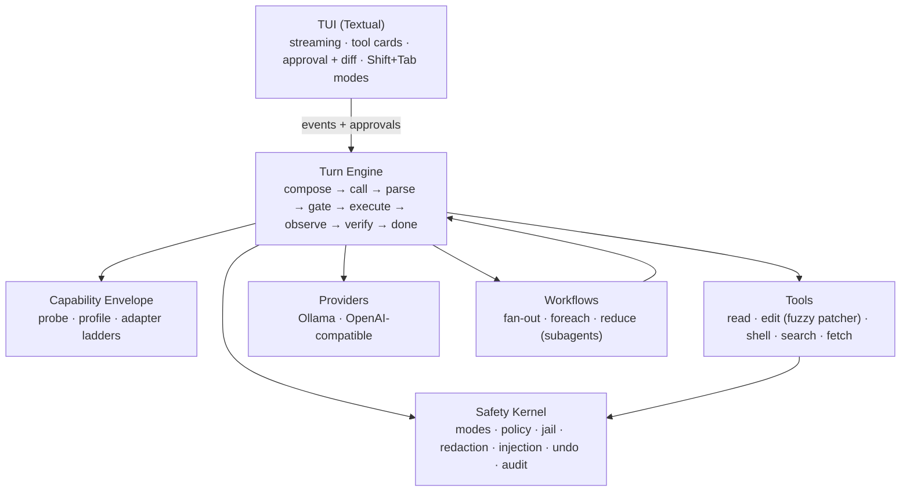

<div align="center">

# ⚙️ IronCore

**The terminal coding agent that molds itself to *your* local model.**

*The intelligence is in the loop, not just the weights.*

[](https://github.com/RealDealCPA-VR/IronCore/actions/workflows/ci.yml)
[](https://www.python.org/)
[](https://github.com/RealDealCPA-VR/IronCore/blob/main/LICENSE)
[](https://github.com/RealDealCPA-VR/IronCore/blob/main/CHANGELOG.md)
[](#built--proven)

</div>

![A two-turn IronCore session in MANUAL mode, opening with a three-line IRONCORE masthead. The agent runs list_dir, read_file and grep — each a tool card on a faint panel with a blue rule down its left edge, the tool name in bold, a blue READ chip, a done state, dim arguments and a green ✓ ok result line — then explains in plain English that fib() is an unfinished stub returning 0. The user's own two questions read in amber above each turn. The status bar reads MANUAL, qwen3-coder:30b, turn 2, 4.2k tok.](https://raw.githubusercontent.com/RealDealCPA-VR/IronCore/main/docs/img/01-session-tool-cards.png)

*Every tool call is named, risk-classified and gated on screen — nothing happens invisibly.*

---

Codex and Claude Code proved what a coding agent can be — *when a frontier model is driving.*
Point the same harness at a 7B–70B open model and it buckles: malformed tool calls, diffs that
don't apply, goals forgotten by turn twelve.

**IronCore starts from the opposite assumption: your model is limited, and that's fine.** Every
job open models are unreliable at — remembering state, formatting protocols, applying patches,
knowing when to stop — moves into deterministic code. What's left for the model is the one
thing it's genuinely good at: local reasoning over a well-framed context. The result is a
terminal agent that squeezes frontier-*shaped* behavior out of the intelligence you actually
have, on hardware you actually own — no API keys, no data leaving the box.

Runs on Linux, macOS and Windows (Python 3.11+). CI exercises Ubuntu and Windows on 3.11 and
3.13, plus macOS on 3.13.

## It measures your model, then adapts to it

Most harnesses *assume* a model can do native tool calls and clean unified diffs, then break
when it can't. IronCore assumes nothing. **The first time you point it at a model, it seeds a
usable profile in ~1 second** from the endpoint's own introspection (Ollama's real context
window via `/api/show` + capability detection) — so the very first turn already runs with the
model's true window and native tool-calling, not a conservative floor. Then a fuller probe
battery deepens the measurement **in the background** and hot-swaps the refined profile in.
No cold-probe wait; the profile is cached under `~/.ironcore/envelopes/` for next time.

| It measures… | …by | so it can pick |
|---|---|---|
| **honest context** | needle-retrieval at rising depths (not the advertised window) | a context budget that won't silently truncate |
| **instruction retention** | a constraint set on turn 1, checked at turns 3/6/9/12 | how often to re-anchor the goal & constraints |
| **tool-call reliability** | N trials per wire protocol | native calls, strict JSON, or the IRONCALL text floor |
| **edit-format reliability** | emit an edit; does the harness patcher *apply* it? | unified diff, search/replace, or whole-file |
| **JSON adherence** | schema-conforming output under distraction | how hard to lean on structured output |
| **code-smoke** | tiny function + failing test → green | the usability floor |

Then it walks **downgrade ladders** instead of failing — always landing on a format the model
can actually produce:

```
tool calls:  native function-calling  →  strict JSON (server-constrained)  →  IRONCALL text protocol
file edits:  unified diff  →  search/replace blocks  →  whole-file rewrite
context:     budgeted composition against the MEASURED honest window, working-set files
anchoring:   goal + constraints re-injected every N turns — N from measured retention
```

The middle rung is real: a model routed to **strict JSON** is driven with server-side
**guided decoding** (`response_format` / json-schema — vLLM, llama.cpp, LM Studio, Ollama) so
its output is *constrained* to a well-formed `{"tool", "args"}` object — guaranteed-parseable
tool calls, not best-effort — with a `done` action so a constrained model can still finish.

![The /envelope report card for qwen3-coder:30b, colour-coded by outcome. Source reads 'measured' in green; honest context 49,152 against an advertised 262,144, with the resulting 19% flagged in red; 3.6 chars per token. A tool-protocol ladder picks native at 0.98, marked SELECTED in green, with strict_json below it greyed as 'ok, fallback' and text_protocol greyed as 'floor (always works)'. An edit-format ladder shows unified_diff at 0.71 in red, 'REJECTED (0.19 short)', and search_replace at 0.93 SELECTED in green. Below: JSON adherence, retention, coherence, vision, and a green verdict of 'usable — native tool calls, search_replace edits'.](https://raw.githubusercontent.com/RealDealCPA-VR/IronCore/main/docs/img/03-envelope-report-card.png)

*`/envelope` — the measurement, not a guess. This model advertises 262k of context; it honestly
retrieves at 49k, and it cannot be trusted with unified diffs, so IronCore stopped using them.
Green is a rung a measurement cleared, red is one that fell short and by how much — but every
verdict is a word first, so the card survives being piped, pasted, or read without colour.*

A capable 30B gets native tool calls and unified diffs. A scrappy 7B gets the IRONCALL text
protocol, whole-file edits, and an anchor every other turn — and *still finishes the task*.
Run `/envelope` to see the report card; run `/probe` anytime to re-measure. **You point; it
molds.**

> Because the harness owns all state, every model call is nearly stateless: the model never has
> to *remember* — IronCore **re-presents**. Small models drift; IronCore doesn't let them.

---

# Getting started

From nothing to a working first turn. If you have no model server yet, skip to
[Try it with no model at all](#try-it-with-no-model-at-all) — that path works right now.

## Prerequisites

- **Python 3.11 or newer.**
- **A local OpenAI-compatible model server.** [Ollama](https://ollama.com) is the smoothest
  path — it keeps your model resident between turns, so there are no reload stalls. vLLM,
  llama.cpp's server and LM Studio all work too.
- **git on your PATH** — a *soft* dependency **at runtime**: without it IronCore runs fine, but
  change-set snapshots are disabled, so `/undo` and `/redo` do nothing. `ironcore doctor` tells
  you which case you are in. It is *not* optional for the `pip install git+https://…` line in
  [Install](#install) — pip needs git to clone. The source-archive install right below it
  doesn't, so a machine with no git can still get IronCore.

With Ollama, a complete cold start looks like this:

```bash
ollama serve                      # start the server (a background service on some installs)
ollama pull qwen2.5-coder:7b      # ~4.7GB — a model most machines can actually run
```

IronCore's shipped default model is `qwen3-coder:30b`, which is roughly 18GB. If you have the
hardware, pull that instead. **If you pull anything else, you must point IronCore at it before
you run `ironcore doctor`** — that is step 2 of [Set it up](#set-it-up) below, and skipping it
is the one way to make doctor fail on a perfectly good machine. (`ironcore doctor` names the
models you actually have, so it tells you exactly what to put there.)

## Install

```bash
pip install ironcore-cli        # or:  uv tool install ironcore-cli  /  pipx install ironcore-cli
```

**The PyPI package is `ironcore-cli`; everything else is still `ironcore`** — the command you
run is `ironcore`, and the import is `import ironcore`. The bare name `ironcore` was refused by
PyPI as too similar to the unrelated `iron-core` package, so the distribution carries the `-cli`
suffix and nothing else changed.

To install the current `main` instead of the last release:

```bash
pip install git+https://github.com/RealDealCPA-VR/IronCore.git
```

That form needs **git on your PATH** — pip shells out to it to clone the repo. If you don't
have git, install the exact same code from GitHub's source archive instead, which needs no git
at all:

```bash
pip install https://github.com/RealDealCPA-VR/IronCore/archive/refs/heads/main.zip
```

Prebuilt wheels are also attached to every
[release](https://github.com/RealDealCPA-VR/IronCore/releases); copy a `.whl` asset URL and hand
it straight to your installer (`uv tool install <wheel-url>` or `pip install <wheel-url>`).

## Try it with no model at all

```bash
ironcore demo
```

This runs a **real IronCore session, fully offline** — no server, no model, no network. The
engine, the safety gate, the patcher and the verification loop are the shipping ones; only the
model's replies are scripted. You watch it read a file, propose an edit as a real diff, pass
through a gate decision, apply the patch and then *verify* the result before calling itself
done. It is the fastest way to see whether this tool is for you.

![Real ironcore demo output: a header naming the temp workspace, the mode as an amber accept-edits chip and 'model: mock (scripted; no network, no real model)'; the user's request, to make greet() end with an exclamation mark, in amber; the assistant reads greeter.py through a tool card led by a blue rule and a READ chip, allowed at the gate, returning a green tick; then an edit_file card led by an amber rule and a filled WRITE chip showing the one-line search_replace diff in red and green, applied to greeter.py; a verify block runs check_feature.py and reports 'verify passed: 1 command (configured)' in green; the turn completes with stop_reason done in green, the final greeter.py is echoed, and the run ends with a green 'demo complete: feature edited, verified green, and the turn stopped on evidence (done)'.](https://raw.githubusercontent.com/RealDealCPA-VR/IronCore/main/docs/img/09-demo.png)

*The whole run, start to finish. The banner names the mock model up front, every tool call
prints its own risk and gate decision, the edit lands as a real diff — and the turn only stops
after `check_feature.py` actually passes. `stop_reason: done` is earned, not announced.*

`ironcore demo --smoke` collapses the same run into one PASS/FAIL line — that is the form for
CI.

## Set it up

Four steps, **in this order**. Step 2 is the one people skip, and it is the one that makes
step 3 pass.

### 1. Write the config

```bash
ironcore init
```

That writes `~/.ironcore/config.toml` — every section, every real default and every off-switch
already commented in — and prints the path. (`ironcore init --project` writes a committable
`./.ironcore/config.toml` instead; `--force` overwrites an existing file, saving what was there
to `config.toml.bak` first — so re-running `init` to start clean cannot lose the `model =` line
you are about to edit in step 2.) You do not strictly
need a config file — every key has a default — but starting from the annotated one is easier
than starting from this README.

### 2. Point it at the model you actually pulled

The shipped default is `qwen3-coder:30b`. **If you pulled something else, change it now** —
`ironcore doctor` in step 3 fails on a model the server doesn't have, which is exactly the
point of it. Open the file `init` just printed and edit the one `model =` line:

```toml
# ~/.ironcore/config.toml
[provider]
base_url = "http://localhost:11434/v1"
model    = "qwen2.5-coder:7b"     # the model you pulled; must already exist on that server
api_key  = "ironcore-local"       # local servers ignore this; hosted ones reject you without it

[safety]
mode = "manual"                   # plan | manual | accept-edits | auto
```

Or skip the file entirely and set it for the shell, which every later command picks up:

```bash
export IRONCORE_MODEL=qwen2.5-coder:7b      # bash / zsh
```

```powershell
$env:IRONCORE_MODEL = "qwen2.5-coder:7b"    # PowerShell
```

### 3. Check it

```bash
ironcore doctor
```

**`ironcore doctor` is the gate.** It exits 1 when something is genuinely misconfigured — an
unusable `base_url`, an endpoint that isn't OpenAI-compatible, a configured model the server
doesn't have, an MCP command that isn't on PATH. A server you simply haven't started yet exits
**0**: that is a thing to start, not a thing to fix.


*Doctor on a machine that hasn't run `ironcore init` yet — which is why it reports defaults.
Every `[--]` and `[FAIL]` line carries the next step, and
[`docs/TROUBLESHOOTING.md`](https://github.com/RealDealCPA-VR/IronCore/blob/main/docs/TROUBLESHOOTING.md)
is keyed line-by-line to this output.*

### 4. Launch

```bash
ironcore
```

Because doctor's exit code is honest, you can chain the two once you trust the setup —
`ironcore doctor && ironcore` in bash, zsh, cmd or PowerShell 7 (Windows PowerShell 5.1 has no
`&&`; run them as two lines there).

## Your first session

Launch `ironcore` from the directory you want to work in — that directory is the workspace, and
the write jail is drawn around it. Then just type what you want.

**Reading the transcript.** Each tool call renders as a card with a risk-coloured rule down its
left edge: the tool's name, a risk chip (`READ`, `WRITE`, `EXEC`, `NET` — the elevated three are
drawn as filled blocks, so one write stands out of a wall of reads), its state (`awaiting
approval` → `done`), the arguments it was called with, and a result line. There is no other path
to a tool — if it happened, there is a card for it, and the gate decided about it first.

**Approving a change.** In the default MANUAL mode, anything that writes stops at the gate and
shows you the exact edit before it lands:

![The approval modal, an amber-bordered panel titled 'Approval required', over a dimmed transcript. Inside: a filled amber WRITE chip beside the plain-language line 'this changes files in your workspace', then edit_file fib.py [search_replace] and the search/replace diff with the removed lines in red and the added lines in green, then three flat text actions — Deny (n), Approve (y) which has focus and reads bold green, and Approve all writes (a). The amber-ruled edit_file tool card that raised the ask is still visible behind the modal.](https://raw.githubusercontent.com/RealDealCPA-VR/IronCore/main/docs/img/02-approval-diff.png)

*The keys are on the buttons: `y` approves this one, `n` denies it, `a` approves writes for the
rest of the session. You are approving a specific diff, not a vague intention.*

**The keys you need**, always visible in the status bar:

| Key | What it does |
|---|---|
| **Shift+Tab** | cycle the safety mode (plan → manual → accept-edits → auto) |
| **Esc** | interrupt the running turn |
| **Ctrl+C** | quit |
| **/** | open the slash-command palette |

`/help` lists every command and ends with the same key reference; `/help <command>`
prints just that command's usage and summary (the exact `verify:` / `run` / interval syntax).

### What to expect on the very first run

Launching on a model IronCore has never measured kicks off the probe battery: roughly **80
short calls**, typically **1–3 minutes** on a local model. Your turns keep working the whole
time — the session starts on an instantly-seeded profile and hot-swaps the refined one in when
it's ready. Turn it off with `auto_probe = false` under `[envelope]` if you'd rather not spend
the tokens.

Interrupting mid-probe is safe. The cache under `~/.ironcore/envelopes/` is written atomically
and heals itself: a profile that got truncated, emptied or corrupted is quarantined next to
itself with a `.corrupt` suffix — for the default model that file is
`qwen3-coder_30b.json.corrupt`, since the model id is slugified for the filesystem — reported
by name in a boot note, and simply re-measured. You never have to clean it up by hand.

### When something goes wrong

Run `ironcore doctor` first — it also prints any setting that was clamped, so "my config didn't
take effect" has a visible cause. Then see
[`docs/TROUBLESHOOTING.md`](https://github.com/RealDealCPA-VR/IronCore/blob/main/docs/TROUBLESHOOTING.md),
which is organized by the exact line doctor printed.

---

# Day-to-day reference

## Safety, baked in — not bolted on

Four operating modes, cycled live with **Shift+Tab**:

| Mode | Reads | File edits | Commands | Network |
|---|---|---|---|---|
| 🔍 **Plan** | ✅ | ⛔ | ⛔ | ⛔ |
| 🤝 **Manual** *(default)* | ✅ | ask | ask | ask |
| ✏️ **Accept Edits** | ✅ | ✅ | ask | ask |
| 🚀 **Auto** | ✅ | ✅ | ✅ sandboxed | ask |

![Shift+Tab cycled through the whole safety loop, printing each mode's contract into the transcript with the mode name carrying its own autonomy colour: accept-edits on a filled amber block applies file edits automatically while commands still ask; auto on a filled red block is full auto inside the workspace sandbox with network still asking; plan in calm blue is read-only, explore and propose, nothing changed; manual in plain grey approves every file edit, command and network call. Below the four contract lines the session carries on — the user's two questions in amber, and list_dir, read_file and grep tool cards each led by a blue rule and a blue READ chip — so the modes are being chosen in the middle of real work rather than on an empty screen. The status chip reads MANUAL, turn 2, 4.2k tok.](https://raw.githubusercontent.com/RealDealCPA-VR/IronCore/main/docs/img/05-safety-modes.png)

*Each mode announces its own contract as you cycle into it, so you always know what you just
authorized.*

- **No tool executes without a policy decision** — there is no other path to a tool, and the
  engine literally can't construct one.
- **Network is never auto-allowed**, even in Auto. Plan mode *cannot* mutate — the gate denies
  it, so a confused (or scheming) model simply can't act.
- Workspace **path jail**, command **deny-lists** (in every mode), **secret redaction** before
  anything reaches the model or the logs, and **prompt-injection guards** on every tool result
  (open models are *more* injectable — IronCore treats tool output as untrusted data).
- Byte-exact **git-snapshot undo** for every change set, and an "is-it-really-done?"
  **verification loop** — IronCore refuses to report unverified work as done.

Full threat model and the honest limits:
[`docs/SAFETY.md`](https://github.com/RealDealCPA-VR/IronCore/blob/main/docs/SAFETY.md).

## Commands

A streaming **Textual** UI, and a thin client over the engine's event stream — the engine
itself never prints or prompts. Type `/` to open the palette:


| Command | What it does |
|---|---|
| `/probe` · `/envelope` | Measure the live model and adapt to it · show its capability report card |
| `/goal <objective>` | Set a persistent objective — IronCore won't call itself done until a stop-condition check passes (auto-pinned from your first message if you don't) |
| `/workflow <name>` | Deterministic multi-agent orchestration (fan-out → verify → reduce) — the *harness* drives the flow, never the model |
| `/model` · `/init` | List models / live-swap the running session to another model (envelope-cache aware) · scan the repo into `IRONCORE.md` project memory |
| `/loop [5m] <prompt>` | Run a prompt on an interval, or let the agent self-pace |
| `/undo` · `/redo` · `/compact` · `/review` · `/memory` | Snapshot undo · history compaction · diff review · project memory |
| `/mode` · `/help [cmd]` · `/version` | Set or cycle the operating mode · list commands and keys, or one command's usage · print the version |

`/goal` is the one worth trying first, because it is where "the intelligence is in the loop"
stops being a slogan: the objective is re-anchored into every turn, and *the harness* — not the
model's opinion of itself — runs the attached command to decide whether the work is done. Even
without `/goal`, the objective is auto-pinned from your first message, so it survives history
compaction instead of quietly getting summarized away. Verify commands — whether attached with
`/goal verify:`, written into `IRONCORE.md`, or auto-detected — are routed through the command
deny-list before they run, so a `verify:` line in a cloned repo can never auto-execute something
destructive.

![A session that opens with an ordinary question — 'what's in this project?', answered via a list_dir tool card led by a blue rule, a blue READ chip and a green ✓ ok — and then formalises the work with /goal set to 'make fib() correct for every n up to 30'. Each typed command is echoed back in amber above the reply it produced, so the three /goal exchanges read as three groups. IronCore replies that the goal is anchored into every turn, lists the attached verify command python -c "import fib; assert fib.fib(30) == 832040", then prints 'Checking the goal against 1 verify command(s)…' followed by the payoff line 'Goal stop-condition MET' in green — all 1 verify command passed.](https://raw.githubusercontent.com/RealDealCPA-VR/IronCore/main/docs/img/06-goal-verified.png)

*The stop-condition is a command that really ran. "Done" is a test result, not a claim.*

Sessions are recorded and resumable: `ironcore --resume` opens a picker of past sessions, and
`ironcore --resume <id>` jumps straight to one.

![The 'Resume a session' picker listing nine past sessions newest-first, each row an age, the opening request and a turn count — from 8m ago 'fix the failing fib tests' 3 turns and 52m ago 'why is the envelope probe picking whole_file?' 5 turns, through 2h ago 'add a --json flag to the report CLI' 6 turns and 1d ago 'why does the parser drop trailing commas?' 4 turns, down to 3d ago 'port the ingest script off requests' 11 turns and 6d ago 'audit the shell tool's timeout handling' 7 turns. The ages line up as a right-aligned column. The first row is selected, shown as a steel-blue band with its text in bold. The panel is titled 'Resume a session' on its border, with 'enter resumes · esc starts fresh' along the bottom edge.](https://raw.githubusercontent.com/RealDealCPA-VR/IronCore/main/docs/img/08-session-picker.png)

*Sessions are listed by what you asked for, not by an opaque id — so you can find yesterday's
thread without knowing its name.*

## Configuration

Built for **Ollama** first. One OpenAI-compatible client also covers **vLLM, llama.cpp server,
LM Studio, OpenRouter, Together, and Groq** — note that the hosted providers, and any local
server started with `--api-key`, **require a real `[provider] api_key`**; the shipped
`"ironcore-local"` default is a placeholder that only local servers ignore. Without it you get
an HTTP 401.

Settings come from four layers, later winning:

```
built-in defaults  ←  ~/.ironcore/config.toml  ←  <workspace>/.ironcore/config.toml  ←  IRONCORE_* env
```

Environment overrides — the fastest way to try something without editing TOML:

| Variable | Overrides |
|---|---|
| `IRONCORE_BASE_URL` | `[provider] base_url` |
| `IRONCORE_MODEL` | `[provider] model` |
| `IRONCORE_API_KEY` | `[provider] api_key` |
| `IRONCORE_MODE` | `[safety] mode` |
| `IRONCORE_ROLE_PLANNER` | `[roles] planner` |
| `IRONCORE_ROLE_CODER` | `[roles] coder` |
| `IRONCORE_ROLE_SUMMARIZER` | `[roles] summarizer` |
| `IRONCORE_ROLE_VERIFIER` | `[roles] verifier` |

Those eight are the complete set `config/settings.py` reads; an empty value is ignored rather
than blanking the key, and env is never clamped.

Set them the way your shell does: `export IRONCORE_MODE=plan` in bash/zsh,
`$env:IRONCORE_MODE = "plan"` in PowerShell, `set IRONCORE_MODE=plan` in cmd.

**A project config can lower autonomy, but never raise it.** The `<workspace>/.ironcore/config.toml`
layer arrives with a `git clone`, so it is the only untrusted one: a cloned repo cannot put you
in AUTO, cannot switch `safety.network_tools` on, cannot re-enable plugins you disabled, and
cannot declare an MCP server. Every clamp prints a note in `ironcore doctor` and as a boot note.
If you want more autonomy, grant it in your own `~/.ironcore/config.toml`, set
`IRONCORE_MODE` in your own environment, or press Shift+Tab — those are you at the keyboard, and they are never clamped.

The same rule is why **MCP servers and `safety.network_tools = true` must live in your user
config**; requested from a project file, they are clamped off with a note. For MCP secrets, use
placeholders rather than literals — `env = { GITHUB_TOKEN = "${GITHUB_TOKEN}" }` is expanded
from your shell at load time (a bare `$VAR` is not), and an unset variable skips that server
with a visible note instead of starting it. Never paste a live token into a committable file.

Full reference — every key, type and default:
[`docs/CONFIG.md`](https://github.com/RealDealCPA-VR/IronCore/blob/main/docs/CONFIG.md).

State lives under `~/.ironcore/` and `<workspace>/.ironcore/`. Project memory (`IRONCORE.md`)
is written at your workspace root on purpose, so you can commit it. If there's no `IRONCORE.md`,
IronCore falls back to an `AGENTS.md` or `CLAUDE.md` you already have, and it also reads a
user-global `~/.ironcore/IRONCORE.md` that follows you across every repo. (Only your project's
own `IRONCORE.md` may carry a `verify:` command — those run, so a cloned repo can't arm one.)

## Architecture at a glance



Strict dependency rule: the **safety kernel imports nothing; everything imports it.** The TUI
is a thin client over an event stream — swap it for a headless runner and the engine doesn't
notice.

## Built & proven

All eleven build phases are shipped, and all eight moonshots landed on top (**v0.2**). Every
phase was validated the same way: a full offline test suite, an *independent adversarial review*
that verifies findings by execution, and real proof tests against files, subprocesses, git, and
the headless UI — **evidence, not claims.** Multiple real bugs (a redaction ReDoS, a
false-"done", a compaction secret-leak, a Plan-mode workflow escape) were caught and fixed
exactly this way.

```bash
git clone https://github.com/RealDealCPA-VR/IronCore.git && cd IronCore
uv run --extra dev pytest -q   # 1797 tests, all offline — no model, no network
```

The suite sandboxes `HOME` itself, so running it cannot touch your own `~/.ironcore`. CI gates
coverage at 90% across the whole `ironcore` package, and builds and smoke-tests the wheel on
every pull request.

## Documentation

Start at the index: [`docs/README.md`](https://github.com/RealDealCPA-VR/IronCore/blob/main/docs/README.md).

**Using IronCore** — [`docs/CONFIG.md`](https://github.com/RealDealCPA-VR/IronCore/blob/main/docs/CONFIG.md) (every setting, with defaults) ·
[`docs/TROUBLESHOOTING.md`](https://github.com/RealDealCPA-VR/IronCore/blob/main/docs/TROUBLESHOOTING.md) (keyed to doctor's output) ·
[`docs/MODELS.md`](https://github.com/RealDealCPA-VR/IronCore/blob/main/docs/MODELS.md) (the envelope in depth) ·
[`docs/SAFETY.md`](https://github.com/RealDealCPA-VR/IronCore/blob/main/docs/SAFETY.md) (threat model & controls)

**Extending or contributing** — [`docs/PLUGINS.md`](https://github.com/RealDealCPA-VR/IronCore/blob/main/docs/PLUGINS.md) (author guide) ·
[`docs/SPEC.md`](https://github.com/RealDealCPA-VR/IronCore/blob/main/docs/SPEC.md) (the full specification) ·
[`docs/ARCHITECTURE.md`](https://github.com/RealDealCPA-VR/IronCore/blob/main/docs/ARCHITECTURE.md) (layers & dependency rules) ·
[`CHANGELOG.md`](https://github.com/RealDealCPA-VR/IronCore/blob/main/CHANGELOG.md) (what's in each release)

## 🌙 Moonshots — landed

These were the bets that would make IronCore mold *deeper* to your model, see beyond text,
and open up to plugins — and as of **v0.2**, every one of them has shipped:

- **Model-aware tokenization.** The probe battery now *measures* each model's chars-per-token
  ratio (known-char filler docs vs the server's reported `prompt_tokens`) and the context
  composer + compaction predicate budget with it — the universal `chars/4` guess only remains
  as the honest default for servers that don't report usage.
- **Live model swaps.** `/model <name>` re-points the *running* session mid-conversation: a
  cached-per-model provider plus the on-disk envelope cache — a measured model hot-swaps its
  profile instantly, an unmeasured one runs on floor defaults while it is seeded and
  deep-probed in the background, and the cache remembers every model you've measured.
- **A model per role, each measured.** The `[roles]` config now routes the turn loop itself:
  PLAN-mode turns run on the planner model, execution turns on the coder, compaction on the
  summarizer — each with *its own* capability envelope from the shared cache, so every routed
  call uses that model's measured wire protocol, context window, and sampling (floor defaults,
  honestly, until a role model is measured; `/envelope` shows per-role status).
- **Best-of-N escape hatches.** When the model dead-ends at a seam with a *mechanical*
  verifier — a tool call that won't parse, a patch that won't apply — the engine resamples
  up to `[engine] best_of_n` candidates at raised temperature and races them: the first one
  that parses / applies in-memory re-enters the normal safety gate and executes; losers are
  discarded, every candidate is charged to the turn budget. Off by default (`best_of_n = 1`).
- **The self-improvement loop.** Every session records mechanical evidence per model — did
  tool calls parse at the active rung, did edits apply in the chosen format, did
  verification pass, did the turn drift — into a per-model outcome ledger next to the
  envelope cache, and at session start a deterministic tuner conservatively *lowers* any
  ladder score the live evidence contradicts (downgrade-only: upgrades are never applied,
  they earn a "run `/probe`" hint), so each model's real-world quirks reshape the ladders
  across sessions. The report card and `/envelope` say `tuned` honestly; off switch:
  `[envelope] auto_tune = false`.
- **Vision — image inputs for screenshots/diagrams.** A new `read_image` tool lets the
  model actually look at a workspace PNG/JPEG/GIF/WEBP: the bytes ride the conversation
  as OpenAI image content-parts (base64 data URIs, so Ollama and vLLM vision models both
  work). The capability is *measured, not assumed*: seeded from Ollama's `/api/show`
  `capabilities` (`[envelope] vision = true` overrides for endpoints without
  introspection), and a text-only model gets an honest "no vision capability" error
  instead of a hallucination. The context composer budgets attached images (flat
  512-token charge each) and keeps only the newest two, stripping older ones with an
  honest marker; the report card gained a `Vision: yes|no` line.
- **MCP tool servers.** Any stdio MCP server now plugs its tools straight into the gated
  registry: a dependency-free JSON-RPC client spawns each `[mcp.servers.<name>]` entry
  from config (resolved via PATH, never through a shell) and registers every remote tool
  as `mcp__<server>__<tool>` at **NET risk** — the strictest class, so nothing an MCP
  server exposes is ever auto-approved, and Plan mode denies it outright. Like the
  built-in `fetch_url`, MCP tools exist only when `safety.network_tools = true` **in your
  user config** (see [Configuration](#configuration)); their output rides the same UNTRUSTED
  fence and injection scan as every tool, servers connect in the background at launch (tools
  appear on the next turn), and `ironcore doctor` reports the configured lineup honestly.
- **Drop-in extensibility.** Providers, tools, slash commands, probes, and edit formats
  now plug in as standard Python entry points (`ironcore.providers` / `ironcore.tools` /
  `ironcore.commands` / `ironcore.probes` / `ironcore.edit_formats`): `pip install` a
  plugin distribution next to IronCore and its tools register behind the *same* safety
  gate (an honest `ToolRisk` per tool; NET stays off unless `safety.network_tools`), its
  provider builds when `provider.type` names it (role routing and `/model` swaps
  included), its probes join `/probe`'s battery, and its edit formats join `edit_file`.
  Built-ins win every name clash, a broken plugin is skipped and reported by
  `ironcore doctor` — never a crashed boot — and `[plugins] enabled = false` turns
  discovery off. Author guide:
  [`docs/PLUGINS.md`](https://github.com/RealDealCPA-VR/IronCore/blob/main/docs/PLUGINS.md).

## Contributing

Start with [`CONTRIBUTING.md`](https://github.com/RealDealCPA-VR/IronCore/blob/main/CONTRIBUTING.md)
— how to set up, run the suite, and open a change. Security reports go through
[`.github/SECURITY.md`](https://github.com/RealDealCPA-VR/IronCore/blob/main/.github/SECURITY.md);
IronCore executes model-proposed shell commands, so please use that channel rather than a
public issue.

Interfaces in [`docs/CONTRACTS.md`](https://github.com/RealDealCPA-VR/IronCore/blob/main/docs/CONTRACTS.md)
are frozen — change the contract first, or don't. If you are an *AI agent* working in this
repo, your instructions are [`AGENTS.md`](https://github.com/RealDealCPA-VR/IronCore/blob/main/AGENTS.md)
and the pickup ritual in [`docs/PROTOCOLS.md`](https://github.com/RealDealCPA-VR/IronCore/blob/main/docs/PROTOCOLS.md).

## License

[MIT](https://github.com/RealDealCPA-VR/IronCore/blob/main/LICENSE) © 2026 RealDealCPA
