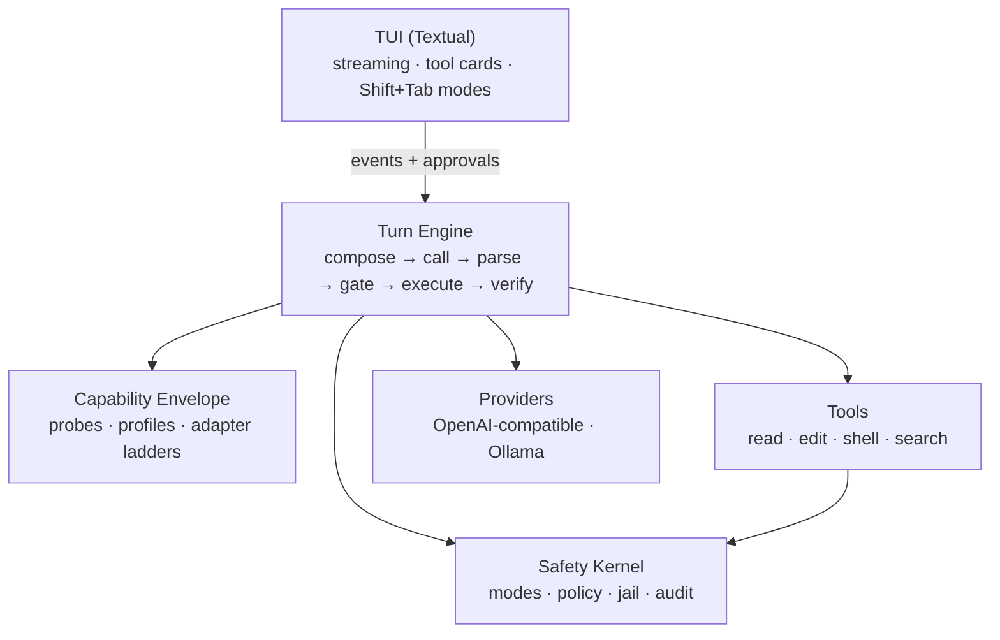

<div align="center">

# ⚙️ IronCore

**A frontier-grade terminal coding agent for open-source models.**

*The intelligence is in the loop, not just the weights.*

[](https://github.com/RealDealCPA-VR/IronCore/actions/workflows/ci.yml)
[](https://www.python.org/)
[](LICENSE)
[](TODO.md)

</div>

---

Codex and Claude Code proved what a coding agent can be — when a frontier model is driving.
Point the same harness at a 7B–70B open model and it falls apart: malformed tool calls,
diffs that don't apply, goals forgotten by turn twelve.

**IronCore starts from the opposite assumption: the model is limited, and that's fine.**
Every job open models are unreliable at — remembering state, formatting protocols, applying
patches, knowing when to stop — moves into deterministic code. What's left for the model is
the thing it's actually good at: local reasoning over a well-framed context. The result is a
terminal agent that gets frontier-*shaped* behavior out of the intelligence you actually have,
running on hardware you actually own.

## How it works: the Capability Envelope

IronCore never assumes what a model can do — it **measures**. On first use of any model, a
~2-minute probe suite scores it and caches a capability profile:

| Probe | Measures |
|---|---|
| `CTX-HONESTY` | the context depth where retrieval actually stays reliable (not the advertised window) |
| `RETENTION` | how many turns before an instruction from turn 1 gets dropped |
| `TOOL-FORM` | tool-call reliability per wire protocol |
| `JSON-STRICT` | schema-conforming output under pressure |
| `EDIT-FORMAT` | which edit format the model can emit that actually *applies* |
| `CODE-SMOKE` | usability floor: small function + failing test → green |

The harness then adapts along **downgrade ladders** instead of failing:

```
tool calls:  native function-calling → strict JSON → IRONCALL text protocol (+ repair loop)
file edits:  unified diff → search/replace blocks → whole-file rewrite
context:     budgeted composition, working-set files, honest-window limits
memory:      anchor turns — goal & constraints re-injected every N turns, N from measured retention
```

And because the harness owns all state, every model call is nearly stateless: the model never
has to *remember* — IronCore **re-presents**. Small models drift; IronCore doesn't let them.

## Safety, baked in — not bolted on

Four operating modes, cycled with **Shift+Tab**:

| Mode | Reads | File edits | Commands | Network |
|---|---|---|---|---|
| 🔍 **Plan** | ✅ | ⛔ | ⛔ | ⛔ |
| 🤝 **Manual** *(default)* | ✅ | ask | ask | ask |
| ✏️ **Accept Edits** | ✅ | ✅ | ask | ask |
| 🚀 **Auto** | ✅ | ✅ | ✅ sandboxed | ask |

- **No tool executes without a policy decision** — there is no other path to a tool.
- **Network is never auto-allowed**, even in Auto mode.
- Workspace path jail, command deny-lists, secret redaction, prompt-injection guards on tool
  output (open models are *more* injectable — IronCore treats every tool result as untrusted).
- Git snapshot **undo** for every change set, and an append-only audit log of every action.

## Slash commands

| Command | What it does |
|---|---|
| `/goal <objective>` | Set a persistent objective — IronCore won't call itself done until a stop-condition check passes |
| `/loop [5m] <prompt>` | Run a prompt on an interval, or let the agent self-pace |
| `/workflow <name>` | Deterministic multi-agent orchestration (fan-out, pipeline, verify) — the *harness* controls the flow, never the model |
| `/mode` | Cycle Plan → Manual → Accept Edits → Auto |
| `/model` | Switch models; list what your endpoint serves |
| `/envelope` · `/probe` | Show / re-measure the current model's capability profile |
| `/init` | Scan the repo and generate `IRONCORE.md` project memory |
| `/compact` · `/undo` · `/review` · `/memory` · `/help` | The usual suspects, done right |

## Works with what you run

One OpenAI-compatible client covers **Ollama, vLLM, llama.cpp server, LM Studio, OpenRouter,
Together, and Groq** — plus native Ollama extras (model discovery, real context-length
introspection). Optional per-role routing: let a 70B plan while a 7B executes, or the reverse.

## Quickstart

> ⚠️ **Pre-TUI stage** — the interactive TUI ships in phase 7, but the whole engine beneath
> it is built and proven. What works today: the full **turn engine** (compose → call →
> parse → gate → execute → observe → verify → done) with malformed-output repair, an
> evidence-based "done" that refuses to lie about unverified work, budget/runaway
> protection, and micro-stepping + history compaction; the complete **safety kernel**
> (mode & command policy, path jail, secret redaction, injection guard, git-snapshot undo,
> approvals); the complete **tool suite** (read/write/edit with a fuzzy patcher,
> cross-platform shell, search, gated network fetch); the **capability envelope** —
> measured probes that pick the tool protocol, edit format, and context budget per model,
> including the IRONCALL floor protocol for weak models; and the full **provider layer**
> (streaming OpenAI-compatible client, Ollama introspection, role routing). An agent using
> these can already read, edit, and run code through a fully gated loop, undo byte-exactly,
> and get frontier-shaped protocol handling out of an open model — all proof-tested
> end-to-end against real files, real subprocesses, and real git, with no mocks.

```bash
# install (Python 3.11+)
pip install git+https://github.com/RealDealCPA-VR/IronCore.git

# check your environment (finds your local Ollama if it's running)
ironcore doctor

# development setup
git clone https://github.com/RealDealCPA-VR/IronCore.git && cd IronCore
uv run --extra dev pytest -q     # everything runs offline — no model, no network
```

## Architecture at a glance



Strict dependency rule: the safety kernel imports nothing; everything imports the safety
kernel. The TUI is a thin client over an event stream — the engine never prints, never prompts.

## Project status & roadmap

The architecture, contracts, and build plan are done; implementation proceeds in one-pass
tasks designed for agent (or human) contributors. Every shipped phase is validated the same
way: full offline test suite, an independent adversarial review with execution-verified
probes, and real-socket proof tests — evidence, not claims.

| Phase | What lands | Status |
|---|---|---|
| 0 | Scaffold, safety kernel, envelope ladders, CI | ✅ shipped |
| 1 | Foundation: config hardening, session state, append-only audit trail, mock failure injection | ✅ shipped · 2026-07-15 |
| 2 | Providers: streaming OpenAI-compat client (fragment-safe tool calls, retries, key redaction), Ollama extras, registry + role routing, capability detection | ✅ shipped · 2026-07-15 · 195 tests, 7 validator findings fixed, real-server proofs |
| 3 | Tool suite: read/list/glob/grep, fuzzy patcher + jailed atomic writes, cross-platform shell (process-tree kill), gated network fetch, registry assembly | ✅ shipped · 2026-07-15 |
| 4 | Safety kernel: path jail, command policy, approval broker, secret redaction, git-snapshot undo, injection guard | ✅ shipped · 2026-07-15 · 753 tests, ReDoS blocker fixed, real-fs/git/subprocess proofs |
| 5 | Turn engine: context composer, gated state machine, repair loops, verification loop, budgets, micro-stepping + compaction | ✅ shipped · 2026-07-16 |
| 6 | Capability envelope: probe runner + CTX/RETENTION/TOOL-FORM/JSON/EDIT/CODE-SMOKE probes, adapter wiring, IRONCALL protocol, sampling | ✅ shipped · 2026-07-16 · 989 tests, 2 blockers fixed (compaction redaction leak, false-success stop), real-engine proofs |
| 7–8 | Textual TUI, slash commands | 📋 specced |
| 9–11 | Workflows, memory/handoff, v0.1 release | 📋 specced |

- 📖 [`docs/SPEC.md`](docs/SPEC.md) — the full specification
- 🏗️ [`docs/ARCHITECTURE.md`](docs/ARCHITECTURE.md) — layers, module map, dependency rules
- 🤝 [`docs/PROTOCOLS.md`](docs/PROTOCOLS.md) — hand-off / pick-up protocol for contributors
- ✅ [`TODO.md`](TODO.md) — the build plan: every task sized for one pass

## Contributing (humans *and* agents)

IronCore is built the way it works: state lives in the repo, not in anyone's head. Start with
[`AGENTS.md`](AGENTS.md), claim a task in [`TODO.md`](TODO.md), follow the pickup ritual in
[`docs/PROTOCOLS.md`](docs/PROTOCOLS.md), and leave a handoff block when you stop. Interfaces
in [`docs/CONTRACTS.md`](docs/CONTRACTS.md) are frozen — change the contract first or don't.

## License

[MIT](LICENSE) © 2026 RealDealCPA
