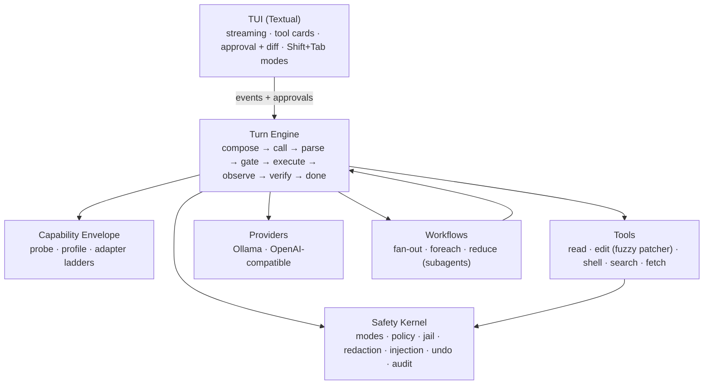

<div align="center">

# ⚙️ IronCore

**The terminal coding agent that molds itself to *your* local model.**

*The intelligence is in the loop, not just the weights.*

[](https://github.com/RealDealCPA-VR/IronCore/actions/workflows/ci.yml)
[](https://www.python.org/)
[](LICENSE)
[](CHANGELOG.md)
[](#built--proven)

</div>

---

Codex and Claude Code proved what a coding agent can be — *when a frontier model is driving.*
Point the same harness at a 7B–70B open model and it buckles: malformed tool calls, diffs that
don't apply, goals forgotten by turn twelve.

**IronCore starts from the opposite assumption: your model is limited, and that's fine.** Every
job open models are unreliable at — remembering state, formatting protocols, applying patches,
knowing when to stop — moves into deterministic code. What's left for the model is the one
thing it's genuinely good at: local reasoning over a well-framed context. The result is a
terminal agent that squeezes frontier-*shaped* behavior out of the intelligence you actually
have, on hardware you actually own — no API keys, no data leaving the box.

## It measures your model, then adapts to it

Most harnesses *assume* a model can do native tool calls and clean unified diffs, then break
when it can't. IronCore assumes nothing. **The first time you point it at a model, it seeds a
usable profile in ~1 second** from the endpoint's own introspection (Ollama's real context
window via `/api/show` + capability detection) — so the very first turn already runs with the
model's true window and native tool-calling, not a conservative floor. Then a fuller probe
battery deepens the measurement **in the background** and hot-swaps the refined profile in.
No cold-probe wait; the profile is cached under `~/.ironcore/envelopes/` for next time.

| It measures… | …by | so it can pick |
|---|---|---|
| **honest context** | needle-retrieval at rising depths (not the advertised window) | a context budget that won't silently truncate |
| **instruction retention** | a constraint set on turn 1, checked at turns 3/6/9/12 | how often to re-anchor the goal & constraints |
| **tool-call reliability** | N trials per wire protocol | native calls, strict JSON, or the IRONCALL text floor |
| **edit-format reliability** | emit an edit; does the harness patcher *apply* it? | unified diff, search/replace, or whole-file |
| **JSON adherence** | schema-conforming output under distraction | how hard to lean on structured output |
| **code-smoke** | tiny function + failing test → green | the usability floor |

Then it walks **downgrade ladders** instead of failing — always landing on a format the model
can actually produce:

```
tool calls:  native function-calling  →  strict JSON (server-constrained)  →  IRONCALL text protocol
file edits:  unified diff  →  search/replace blocks  →  whole-file rewrite
context:     budgeted composition against the MEASURED honest window, working-set files
anchoring:   goal + constraints re-injected every N turns — N from measured retention
```

The middle rung is real: a model routed to **strict JSON** is driven with server-side
**guided decoding** (`response_format` / json-schema — vLLM, llama.cpp, LM Studio, Ollama) so
its output is *constrained* to a well-formed `{"tool", "args"}` object — guaranteed-parseable
tool calls, not best-effort — with a `done` action so a constrained model can still finish.

A capable 30B gets native tool calls and unified diffs. A scrappy 7B gets the IRONCALL text
protocol, whole-file edits, and an anchor every other turn — and *still finishes the task*.
Run `/envelope` to see the report card; run `/probe` anytime to re-measure. **You point; it
molds.**

> Because the harness owns all state, every model call is nearly stateless: the model never has
> to *remember* — IronCore **re-presents**. Small models drift; IronCore doesn't let them.

## Safety, baked in — not bolted on

Four operating modes, cycled live with **Shift+Tab**:

| Mode | Reads | File edits | Commands | Network |
|---|---|---|---|---|
| 🔍 **Plan** | ✅ | ⛔ | ⛔ | ⛔ |
| 🤝 **Manual** *(default)* | ✅ | ask | ask | ask |
| ✏️ **Accept Edits** | ✅ | ✅ | ask | ask |
| 🚀 **Auto** | ✅ | ✅ | ✅ sandboxed | ask |

- **No tool executes without a policy decision** — there is no other path to a tool, and the
  engine literally can't construct one.
- **Network is never auto-allowed**, even in Auto. Plan mode *cannot* mutate — the gate denies
  it, so a confused (or scheming) model simply can't act.
- Workspace **path jail**, command **deny-lists** (in every mode), **secret redaction** before
  anything reaches the model or the logs, and **prompt-injection guards** on every tool result
  (open models are *more* injectable — IronCore treats tool output as untrusted data).
- Byte-exact **git-snapshot undo** for every change set, and an "is-it-really-done?"
  **verification loop** — IronCore refuses to report unverified work as done.

## The interactive terminal app

A streaming **Textual** UI, and a thin client over the engine's event stream — the engine
itself never prints or prompts.

- Live **streaming transcript** with tool cards (name · risk chip · gate decision · result).
- An **approval modal** with a colored **diff viewer** — see the exact edit before it lands.
- A **slash-command palette** with completion, and **resumable sessions** (`--resume`).

| Command | What it does |
|---|---|
| `/probe` · `/envelope` | Measure the live model and adapt to it · show its capability report card |
| `/goal <objective>` | Set a persistent objective — IronCore won't call itself done until a stop-condition check passes |
| `/workflow <name>` | Deterministic multi-agent orchestration (fan-out → verify → reduce) — the *harness* drives the flow, never the model |
| `/model` · `/init` | List models / live-swap the running session to another model (envelope-cache aware) · scan the repo into `IRONCORE.md` project memory |
| `/loop [5m] <prompt>` | Run a prompt on an interval, or let the agent self-pace |
| `/undo` · `/redo` · `/compact` · `/review` · `/memory` | Snapshot undo · history compaction · diff review · project memory |

## Works with what you run

Built for **Ollama** first — it keeps your model resident between turns (`keep_alive`, no
reload stalls). One OpenAI-compatible client also covers **vLLM, llama.cpp server, LM Studio,
OpenRouter, Together, and Groq**. Configure it in one TOML file:

```toml
# ~/.ironcore/config.toml  (or <project>/.ironcore/config.toml)
[provider]
base_url = "http://localhost:11434/v1"
model    = "qwen3-coder:30b"

[safety]
mode = "manual"          # plan | manual | accept-edits | auto
```

## Quickstart

```bash
# install (Python 3.11+) — once published to PyPI:
pip install ironcore        # or:  uv tool install ironcore  /  pipx install ironcore
# latest from source:
pip install git+https://github.com/RealDealCPA-VR/IronCore.git

ironcore doctor             # checks python, config, your endpoint, and probe status
ironcore                    # launch the TUI (auto-probes your model on first run)
ironcore --resume           # pick up a past session

python -m demo              # a fully offline, no-model walkthrough of a real session
```

Developing on IronCore itself:

```bash
git clone https://github.com/RealDealCPA-VR/IronCore.git && cd IronCore
uv run --extra dev pytest -q   # 1229 tests, all offline — no model, no network
```

## Architecture at a glance



Strict dependency rule: the **safety kernel imports nothing; everything imports it.** The TUI
is a thin client over an event stream — swap it for a headless runner and the engine doesn't
notice.

## Built & proven

All eleven build phases are shipped (**v0.1**). Every phase was validated the same way: a full
offline test suite, an *independent adversarial review* that verifies findings by execution,
and real proof tests against files, subprocesses, git, and the headless UI — **evidence, not
claims.** Multiple real bugs (a redaction ReDoS, a false-"done", a compaction secret-leak, a
Plan-mode workflow escape) were caught and fixed exactly this way.

- 📖 [`docs/SPEC.md`](docs/SPEC.md) — the full specification · 🏗️ [`docs/ARCHITECTURE.md`](docs/ARCHITECTURE.md) — layers & dependency rules
- 🛡️ [`docs/SAFETY.md`](docs/SAFETY.md) — threat model & controls · 🧠 [`docs/MODELS.md`](docs/MODELS.md) — the envelope in depth
- 📝 [`CHANGELOG.md`](CHANGELOG.md) — what's in v0.1

## 🌙 Moonshots — where we're aiming next

v0.1 molds to your model — instantly (above), and the strict-JSON rung is now real
server-side guided decoding (above). These are the bets that would make it mold *deeper*:

- **Drop-in extensibility.** Providers, tools, edit formats, probes, and slash commands as
  entry-point plugins — extend IronCore without touching core.
- **Beyond text.** Vision for screenshots/diagrams, MCP tool servers, and a self-improvement
  loop that learns each model's quirks across sessions and tunes the ladders automatically.

**Shipped:**

- **Model-aware tokenization.** The probe battery now *measures* each model's chars-per-token
  ratio (known-char filler docs vs the server's reported `prompt_tokens`) and the context
  composer + compaction predicate budget with it — the universal `chars/4` guess only remains
  as the honest default for servers that don't report usage.
- **Live model swaps.** `/model <name>` re-points the *running* session mid-conversation: a
  cached-per-model provider plus the on-disk envelope cache — a measured model hot-swaps its
  profile instantly, an unmeasured one runs on floor defaults while it is seeded and
  deep-probed in the background, and the cache remembers every model you've measured.
- **A model per role, each measured.** The `[roles]` config now routes the turn loop itself:
  PLAN-mode turns run on the planner model, execution turns on the coder, compaction on the
  summarizer — each with *its own* capability envelope from the shared cache, so every routed
  call uses that model's measured wire protocol, context window, and sampling (floor defaults,
  honestly, until a role model is measured; `/envelope` shows per-role status).
- **Best-of-N escape hatches.** When the model dead-ends at a seam with a *mechanical*
  verifier — a tool call that won't parse, a patch that won't apply — the engine resamples
  up to `[engine] best_of_n` candidates at raised temperature and races them: the first one
  that parses / applies in-memory re-enters the normal safety gate and executes; losers are
  discarded, every candidate is charged to the turn budget. Off by default (`best_of_n = 1`).

## Contributing (humans *and* agents)

IronCore is built the way it works: state lives in the repo, not in anyone's head. Start with
[`AGENTS.md`](AGENTS.md), follow the pickup ritual in [`docs/PROTOCOLS.md`](docs/PROTOCOLS.md),
and leave a handoff block when you stop. Interfaces in [`docs/CONTRACTS.md`](docs/CONTRACTS.md)
are frozen — change the contract first, or don't.

## License

[MIT](LICENSE) © 2026 RealDealCPA
