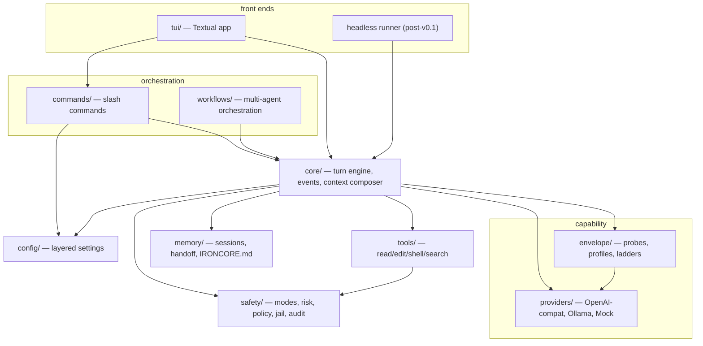

# IronCore Architecture

> Companion to [SPEC.md](SPEC.md). This document is about *shape*: layers, dependency rules,
> data flow, and where new code goes. If you're about to add an import that this document
> says shouldn't exist, stop and redesign.

## 1. Layer diagram



## 2. Module map

| Package | Responsibility | Key types | Imports allowed |
|---|---|---|---|
| `safety/` | modes, risk taxonomy, policy gate, (jail, command policy, redaction, audit) | `Mode`, `ToolRisk`, `Decision`, `decide()` | **stdlib only** |
| `config/` | layered TOML+env settings | `Settings` | stdlib, pydantic |
| `providers/` | model I/O; wire types | `Provider`, `Message`, `ToolCall`, `StreamEvent`, `MockProvider` | config |
| `envelope/` | measured capability profiles; adapter ladders; probes | `CapabilityProfile`, `ProbeSpec` | providers |
| `tools/` | the agent's hands | `Tool`, `ToolResult`, `ToolRegistry` | safety, config |
| `core/` | turn engine, context composer, events | `TurnEngine`, `Event` | everything below it |
| `commands/` | slash command registry + handlers | `SlashCommand`, `CommandRegistry`, `CommandContext` | core and below |
| `workflows/` | deterministic orchestration | `WorkflowRunner` | core and below |
| `memory/` | sessions, compaction, handoff, project memory | `Handoff` | config |
| `tui/` | Textual front end | (IC-701) | core events + commands ONLY |
| `plugins.py` | entry-point plugin discovery (MS-5) | `LoadedPlugins`, `load_plugins()` | anything except tui (only the app/cli layer imports it; registries take a `plugins=` value) |
| `cli.py` | entry point, doctor | — | anything |

## 3. One turn, end to end

```
user input
  └─ tui/ ──────────────── engine.run_turn(input) ──────────────┐
                                                                 ▼
   COMPOSE   composer builds messages from harness state:
             system(envelope template) + anchors(goal/mode/step)
             + working-set excerpts + compacted history + input
   CALL      provider.stream(...) with envelope-selected protocol
   PARSE     extract tool calls (native | strict_json | ironcall)
             malformed → repair re-ask (bounded) → ladder down
   GATE      decide(mode, tool.risk)
             allow → EXECUTE          ask → ApprovalRequired event,
             deny → framed refusal          await front-end future
   EXECUTE   registry.get(name).run(**args)   [jail + policy inside
             WRITE/EXEC tool implementations]
   OBSERVE   truncate + redact + wrap output; append; → CALL
             until no tool calls or budget trips
   VERIFY    if WRITE/EXEC happened: run verify commands, feed
             failures back once, then surface honestly
   DONE      TurnCompleted(stop_reason=evidence-based)
```

Everything above the provider call is deterministic and unit-testable with `MockProvider`.

## 4. Dependency rules (enforced in review)

1. `safety/` imports **stdlib only**. It is the kernel; everything may import it.
2. Nothing imports `tui/` except `cli.py`. The engine communicates outward exclusively via
   `core/events.py` and approval futures.
3. `providers/` never import `tools/`, `core/`, or `commands/` — they speak wire types only.
4. Concrete code programs against `Provider` / `Tool` ABCs, never concrete classes
   (`MockProvider` substitutes everywhere — that's the offline-test guarantee).
5. No module reads config files directly; only `config/` touches disk for settings.
6. Frozen interfaces live in [CONTRACTS.md](CONTRACTS.md); changing one requires updating
   that file *in the same commit*.

## 5. State ownership

| State | Owner | Persistence |
|---|---|---|
| mode, goal, working set, plan cursor | session state (core) | `.ironcore/state.json` |
| transcript | session store (memory) | `.ironcore/sessions/*.jsonl` |
| capability profiles | envelope | `~/.ironcore/envelopes/*.json` |
| audit trail | safety | `.ironcore/audit/*.jsonl` (append-only) |
| undo snapshots | safety | shadow git ref |
| project memory | memory | `IRONCORE.md` (committable) |
| contributor coordination | humans+agents | `TODO.md`, `HANDOFF.md` (committable) |

The model owns **nothing**. Any state the model needs is re-presented at COMPOSE time.

## 6. Extension points

- **New tool**: subclass `Tool`, pick one honest `ToolRisk`, register. Policy is automatic.
- **New provider**: implement `Provider`; wire types are frozen.
- **New probe**: add a `ProbeSpec` + runner; scores flow into existing profile fields or new
  ones (additive).
- **New slash command**: `SlashCommand` in `commands/`; handlers stay synchronous and delegate
  long work to the engine/scheduler.
- **New workflow**: YAML in `.ironcore/workflows/` — no code changes at all.

Everything above can also ship as a **pip-installable plugin** (MS-5, CONTRACTS §11,
author guide in [PLUGINS.md](PLUGINS.md)) — declare entry points in the plugin's
pyproject.toml, no IronCore changes at all:

```toml
[project.entry-points."ironcore.tools"]        # factory(settings, workspace) -> Tool(s)
mytool = "my_pkg.tools:build"
[project.entry-points."ironcore.commands"]     # SlashCommand | Sequence[SlashCommand]
mycmds = "my_pkg.commands:COMMANDS"
[project.entry-points."ironcore.probes"]       # zero-arg factory -> Probe(s)
myprobe = "my_pkg.probes:build"
[project.entry-points."ironcore.providers"]    # factory(base_url=, api_key=, model=)
myprov = "my_pkg.provider:MyProvider"          # selected by provider.type = "myprov"
[project.entry-points."ironcore.edit_formats"] # apply(original, edit) -> PatchResult
myfmt = "my_pkg.formats:apply_myfmt"
```

`ironcore.plugins.load_plugins` discovers these at boot (fail-safe: broken plugins are
skipped + reported, `doctor` shows the list) and the app threads the result into the
tool/command/provider registries and the probe battery. Builtins win duplicate names;
the safety gate applies to plugin tools unchanged.
