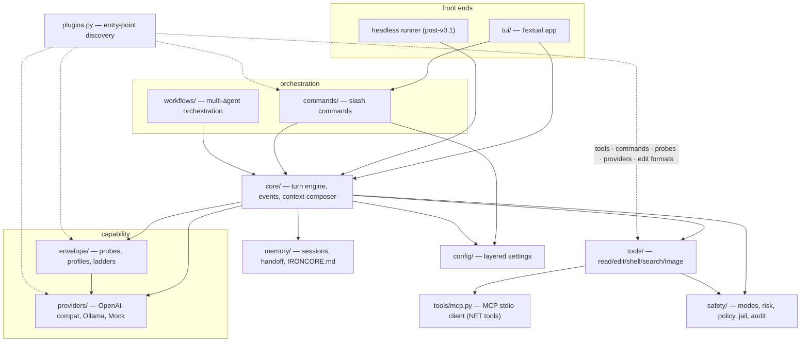

# IronCore Architecture

> Companion to [SPEC.md](SPEC.md). This document is about *shape*: layers, dependency rules,
> data flow, and where new code goes. If you're about to add an import that this document
> says shouldn't exist, stop and redesign.

## 1. Layer diagram



Dotted edges are *contributions*, not imports: `cli.py` / the TUI load plugins once and pass
the result into the registries, so no registry imports `plugins.py` (§4 rule 7). MCP tools are
built by `tools/mcp.py` and registered into the same `ToolRegistry` as builtins at
`ToolRisk.NET` — they get no special path through the gate.

## 2. Module map

| Package | Responsibility | Key types | Imports allowed |
|---|---|---|---|
| `safety/` | modes, risk taxonomy, policy gate, (jail, command policy, redaction, audit) | `Mode`, `ToolRisk`, `Decision`, `decide()` | **stdlib only** |
| `config/` | layered TOML+env settings | `Settings` | stdlib, pydantic |
| `providers/` | model I/O; wire types | `Provider`, `Message`, `ToolCall`, `StreamEvent`, `MockProvider` | config |
| `envelope/` | measured capability profiles; adapter ladders; probes | `CapabilityProfile`, `ProbeSpec` | providers |
| `tools/` | the agent's hands | `Tool`, `ToolResult`, `ToolRegistry` | safety, config |
| `core/` | turn engine, context composer, events | `TurnEngine`, `Event` | everything below it |
| `commands/` | slash command registry + handlers | `SlashCommand`, `CommandRegistry`, `CommandContext` | core and below |
| `workflows/` | deterministic orchestration | `WorkflowRunner` | core and below |
| `memory/` | sessions, compaction, handoff, project memory | `Handoff` | config |
| `tui/` | Textual front end | (IC-701) | core events + commands ONLY |
| `plugins.py` | entry-point plugin discovery (MS-5) | `LoadedPlugins`, `load_plugins()` | anything except tui (only the app/cli layer imports it; registries take a `plugins=` value) |
| `demo/` | the offline scripted session `ironcore demo` runs (ships in the wheel) | — | core and below + `MockProvider` — never a network or a real model |
| `cli.py` | entry point, `doctor`, `init`, `demo` | — | anything |

### 2.1 Modules worth knowing about

The packages above are the dependency unit; these individual modules carry rules of their own.

| Module | Responsibility | Import rule |
|---|---|---|
| `core/roles.py` | `RoleRouter` (MS-3): resolves a role to its provider **and that model's own envelope** from the shared cache; unresolvable roles degrade to the primary pair, never an error | imports providers + envelope + config; imported by `core/engine.py`; never imports tools/commands/tui |
| `core/resample.py` | best-of-N racing at the two mechanically verified seams (MS-4) | core-internal; winners re-enter the normal gate |
| `envelope/seed.py` | the ~1s instant-on profile from endpoint introspection (§2.1 of MODELS.md) | envelope → providers only; never raises |
| `envelope/outcomes.py` | `OutcomeLedger` + downgrade-only tuning (MS-8) | pydantic + stdlib + `envelope.profile` **only** — nothing from core/tools/commands/tui |
| `tools/mcp.py` | MCP stdio client + `MCPManager`; registers `mcp__<server>__<tool>` at `ToolRisk.NET` | obeys the `tools/` rule (safety + config); spawns via `create_subprocess_exec`, never a shell |
| `tools/patch.py` | the deterministic edit appliers behind `edit_file` — **not** a registered tool | stdlib only; pure text transforms, touches no filesystem |
| `tools/image.py` | `read_image`; attaches image parts only when vision is enabled | `tools/` rule; degrades to an honest error on a text-only model |
| `term.py` | the palette + styled stdout for everything printed OUTSIDE the app (`doctor`, `demo`, `init`, the banner) — colour auto-off when stdout is not a TTY, glyphs degrade to ASCII on a stream that cannot encode them | leaf: rich + stdlib, imports nothing from `ironcore`. Duplicates `tui/theme.py`'s palette because §4 forbids importing `tui/`; `tests/test_term.py` pins the two together |

## 3. One turn, end to end

```
user input
  └─ tui/ ──────────────── engine.run_turn(input) ──────────────┐
                                                                 ▼
   COMPOSE   composer builds messages from harness state:
             system(envelope template) + anchors(goal/mode/step)
             + working-set excerpts + compacted history + input
   CALL      provider.stream(...) with envelope-selected protocol
   PARSE     extract tool calls (native | strict_json | ironcall)
             malformed → repair re-ask (bounded) → ladder down
   GATE      decide(mode, tool.risk)
             allow → EXECUTE          ask → ApprovalRequired event,
             deny → framed refusal          await front-end future
   EXECUTE   registry.get(name).run(**args)   [jail + policy inside
             WRITE/EXEC tool implementations]
   OBSERVE   truncate + redact + wrap output; append; → CALL
             until no tool calls or budget trips
   VERIFY    if WRITE/EXEC happened: run verify commands, feed
             failures back once, then surface honestly
   DONE      TurnCompleted(stop_reason=evidence-based)
```

Everything above the provider call is deterministic and unit-testable with `MockProvider`.

## 4. Dependency rules (enforced in review)

1. `safety/` imports **stdlib only**. It is the kernel; everything may import it.
2. Nothing imports `tui/` except `cli.py`. The engine communicates outward exclusively via
   `core/events.py` and approval futures.
3. `providers/` never import `tools/`, `core/`, or `commands/` — they speak wire types only.
4. Concrete code programs against `Provider` / `Tool` ABCs, never concrete classes
   (`MockProvider` substitutes everywhere — that's the offline-test guarantee).
5. No module reads config files directly; only `config/` touches disk for settings.
6. Frozen interfaces live in [CONTRACTS.md](CONTRACTS.md); changing one requires updating
   that file *in the same commit*.
7. Only the app layer (`cli.py`, `tui/`) imports `plugins.py`. Registries never discover
   plugins themselves — they accept an already-loaded `LoadedPlugins` as a `plugins=`
   argument, which is what keeps `tools/` free of an `ironcore.plugins` import and keeps
   every registry testable with no entry points installed.

## 5. State ownership

| State | Owner | Persistence |
|---|---|---|
| mode, goal, working set, plan cursor | session state (core) | `.ironcore/state.json` |
| transcript | session store (memory) | `.ironcore/sessions/*.jsonl` |
| capability profiles | envelope | `~/.ironcore/envelopes/<slug>.json` |
| live outcome evidence (MS-8) | envelope | `~/.ironcore/envelopes/<slug>.outcomes.json` — a sidecar beside the profile; downgrade-only tuning input, never written back into the profile |
| quarantined caches | envelope | `~/.ironcore/envelopes/<slug>.json.corrupt` — an unreadable cache is renamed aside, never deleted, and the model re-probes |
| audit trail | safety | `.ironcore/audit/*.jsonl` (append-only) |
| undo snapshots | safety | `.ironcore/snapshots/` — a private shadow git repo; never touches the user's index, branches or remotes |
| settings | config | `~/.ironcore/config.toml` (user) + `.ironcore/config.toml` (project, committable, autonomy-clamped) |
| project memory | memory | `IRONCORE.md` (committable) |
| workflow definitions | workflows | `.ironcore/workflows/*.yaml` (committable; user-authored) — shadows the built-ins shipped in `ironcore/workflows/builtin/` |
| contributor coordination | humans+agents | `TODO.md`, `HANDOFF.md` (committable) |

Durability is **not** uniform across those rows, and the differences are deliberate. There are
three classes, and every row is in exactly one:

1. **Atomic replace.** `state.json`, the envelope profile and its outcomes sidecar, the
   snapshot index, and every file the write tools produce are staged to a unique sibling in
   the target's own directory, `fsync`ed, then published with `os.replace`
   (`envelope/profile.py::_atomic_write_json`, `core/state.py`, `safety/snapshots.py`,
   `tools/fs_write.py::_atomic_write`). Readers are tolerant, so an interrupted write degrades
   to "unmeasured" — a corrupt envelope cache is renamed `.corrupt` and re-probed — never to a
   crash on next boot.
2. **Append with flush, under a lock.** The session transcript and the audit trail are JSONL
   and are *not* atomic by design: each event is one `json.dumps` line plus newline written and
   flushed in a single call, with nothing buffered across events, so a crash loses at most the
   in-flight line and the tolerant readers skip unparseable lines. Because a Windows `"a"`-mode
   append is seek-to-EOF-then-write rather than an atomic operation, both writers serialize —
   a per-path thread lock, and for the audit trail an OS advisory lock as well, so concurrent
   sessions cannot interleave and lose whole records. Rewriting these files atomically would
   mean rewriting the whole log per event and is the wrong trade.
3. **Plain write.** `IRONCORE.md` is written with a single truncating `write_text`
   (`commands/initcmd.py`, `commands/memorycmd.py`). It is human-authored project memory, git
   is the recovery path, and an interrupted `/init` or `/memory` can leave it short — the only
   row here without a crash-safety story.

Location is likewise not uniform: most rows live under `~/.ironcore/` or the workspace's
`.ironcore/`, but `IRONCORE.md` is written at the **workspace root**, and `TODO.md` /
`HANDOFF.md` at the **repo root** — those three are committable by design, which is the point
of keeping them out of the state directory.

The model owns **nothing**. Any state the model needs is re-presented at COMPOSE time.

## 6. Extension points

- **New tool**: subclass `Tool`, pick one honest `ToolRisk`, register. Policy is automatic.
- **New provider**: implement `Provider`; wire types are frozen.
- **New probe**: add a `ProbeSpec` + runner; scores flow into existing profile fields or new
  ones (additive).
- **New slash command**: `SlashCommand` in `commands/`; handlers stay synchronous and delegate
  long work to the engine/scheduler.
- **New workflow**: YAML in `.ironcore/workflows/` — no code changes at all.

Everything above can also ship as a **pip-installable plugin** (MS-5, CONTRACTS §11,
author guide in [PLUGINS.md](PLUGINS.md)) — declare entry points in the plugin's
pyproject.toml, no IronCore changes at all:

```toml
[project.entry-points."ironcore.tools"]        # factory(settings, workspace) -> Tool(s)
mytool = "my_pkg.tools:build"
[project.entry-points."ironcore.commands"]     # SlashCommand | Sequence[SlashCommand]
mycmds = "my_pkg.commands:COMMANDS"
[project.entry-points."ironcore.probes"]       # zero-arg factory -> Probe(s)
myprobe = "my_pkg.probes:build"
[project.entry-points."ironcore.providers"]    # factory(base_url=, api_key=, model=)
myprov = "my_pkg.provider:MyProvider"          # selected by provider.type = "myprov"
[project.entry-points."ironcore.edit_formats"] # apply(original, edit) -> PatchResult
myfmt = "my_pkg.formats:apply_myfmt"
```

`ironcore.plugins.load_plugins` discovers these at boot (fail-safe: broken plugins are
skipped + reported, `doctor` shows the list) and the app threads the result into the
tool/command/provider registries and the probe battery. Builtins win duplicate names;
the safety gate applies to plugin tools unchanged.
